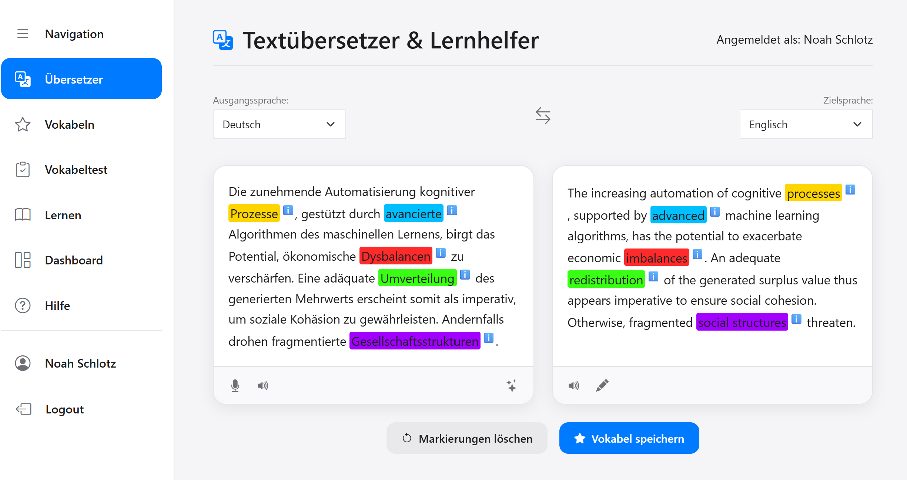

# NLP Project
# 📚 Vokabeltrainer mit Textmarkierung

## Beschreibung des Projektes


### 📝 Projektidee

Unser Vokabeltrainer ist eine webbasierte Anwendung, die eine intelligente und personalisierte Umgebung zum Sprachenlernen bietet. Nach dem Login erhalten Nutzer:innen Zugriff auf eine individuell angepasste Lernplattform, in der sie eigene Texte eingeben und automatisch übersetzen lassen können.

Besonders hervorzuheben ist unser Übersetzer. Er bietet die Möglichkeit, einzelne Wörter im Text zu markieren, die das zugehörige Wort in der Übersetzung hervorheben. Diese werden nicht nur farblich hervorgehoben – wobei jede neue Markierung eine eigene Farbe erhält –, sondern auch automatisch an allen Stellen im Text erkannt und ebenfalls markiert. Die Anwendung erkennt dabei nicht nur Einzelwörter, sondern auch zusammenhängende Wortgruppen, die inhaltlich gemeinsam übersetzt werden. Man kann sich auch selber im Übersetze Texte gezielt nach Schwierigkeit generieren lassen zum Üben der Sprache und sich auch Lücken generieren, um Wörter und Sprachverständnis zu üben. Innerhalb des Übersetzers gibt es zusätzlich die Möglichkeit überSTT mit Whisper Sprachaufnahmen sich transkripieren zu lassen. Zuletzt kann man durch die integrierte ElevenLabs API (TTS) sich Texte und Vokablen vorlesen lassen, um gezielt die Aussprache zu üben und zu verbessern.

Ein zentrales Element des Vokabeltrainers ist die Verbindung von Übersetzung und Sprachverständnis: Beim Überfahren eines markierten Wortes mit der Maus werden Definitionen, Beispielsätze oder weiterführende Informationen angezeigt. Markierte Wörter können dauerhaft gespeichert werden und landen in einer persönlichen Vokabelliste, die über eine Fuzzy-Suche schnell und fehlertolerant durchsuchbar ist.

Auf Basis dieser gespeicherten Vokabeln lassen sich individuell angepasste Vokabeltests generieren. Zusätzlich bietet die Anwendung einen Lernmodus mit Karteikartenfunktion, in dem Nutzer:innen gezielt trainieren können. Unterstützt wird dies durch ein zentrales Dashboard, das eine Übersicht über gespeicherte Vokabeln, Testergebnisse und den persönlichen Lernfortschritt liefert.

Unser Ziel ist es, durch moderne Sprachverarbeitung, smarte Interaktionen und visuelles Feedback eine motivierende und nachhaltige Vokabellern-Erfahrung zu schaffen.


<div style="display: flex; justify-content: center; margin-top: 20px;">
  
</div>

<p style="text-align: center;"><em>Abb.1: Übersetzer des Vokabeltrainers.</em></p>


💡 Die Anwendung hat einen hohen Praxisbezug, erfordert allerdings einiges an Frontend-Arbeit.

---

### 👥 Gruppenmitglieder

- Maxi Zvada  
- Lukas Ihrig  
- Florian Wölfel  
- Noah Schlotz  
- Marius Essig

---

### Anforderungen an die Anwendung

#### Benutzerfunktionen

- User kann sich einloggen und hat eine personalisierte Anwendung

#### Übersetzungsfunktionen

- Text kann eingegeben werden und wird automatisch übersetzt

#### Markierung von Wörtern

- Einzelne Wörter können markiert werden und werden dann farbig hinterlegt  
  _Hinweis_: Die Farbe soll unterschiedlich sein, wenn bereits ein Wort in einem Text markiert wurde – beim nächsten Wort soll eine andere Farbe verwendet werden.
- Das markierte Wort soll automatisch in allen Vorkommen des Textes markiert werden

#### Übersetzungslogik

- Sollten mehrere Worte zu einer Übersetzung gehören, sollen diese alle gefunden werden und entsprechend markiert werden

#### Zusatzfunktionen

- Mouseover über ein Wort soll es möglich machen, Definitionen oder Beispielsätze o.Ä. anzuzeigen

---

## 🚀 Installation & Setup

### 1. 📦 Voraussetzungen

- Python 3.10 oder höher
- [Node.js](https://nodejs.org/) (nur für Dev-Tools, optional)
- Paketmanager wie `pip`

### 2. 🔁 Repository klonen

```bash
git clone https://github.com/FloWoe/NLP_Project.git
cd dein-repo
```

### 3. Benötigte Libaires/Spacy Sprachmodelle laden installieren:

```bash
pip install -r requirements.txt
phyton spacy_install.py
pip install git+https://github.com/openai/whisper.git

```

### 4. 🎙️  Whisper vorbereiten (Speech-to-Text)

Whisper benötigt [ffmpeg](https://ffmpeg.org/), um Audio korrekt zu verarbeiten.

#### 🪟 Windows:

1. Lade die neueste ffmpeg-Version von der offiziellen Seite herunter:  
   👉 [https://www.gyan.dev/ffmpeg/builds/](https://www.gyan.dev/ffmpeg/builds/)

2. Entpacke den ZIP-Ordner z. B. nach:  
   `C:\ffmpeg`

3. Füge den Pfad zu `ffmpeg/bin` in deine **Systemumgebungsvariablen** hinzu:

   - Öffne die Windows-Suche und tippe: **"Umgebungsvariablen bearbeiten"**
   - Klicke bei **"Systemvariablen"** auf `Path` → `Bearbeiten`
   - Klicke auf `Neu` und füge hinzu:  
     `C:\ffmpeg\bin`

4. Starte das Terminal oder PowerShell neu und überprüfe, ob `ffmpeg` korrekt installiert ist:

   ```bash
   ffmpeg -version
   ```


### 🔐 5. API Keys erstellen (ausführlich)

Für den Betrieb der Anwendung benötigst du **vier API-Keys**:

| Dienst                    | Benötigter Key              | Beschreibung                                   |
|--------------------------|-----------------------------|------------------------------------------------|
| Google Cloud Translation | `GOOGLE_TRANSLATE_API_KEY`  | Für Textübersetzungen                         |
| Google Gemini            | `GEMINI_API_KEY`            | Für Kontextvergleiche mit dem Gemini-Modell   |
| Google Cloud TTS         | `GOOGLE_TTS_API_KEY`        | (Optional) Für Googles Text-to-Speech         |
| ElevenLabs               | `ELEVENLABS_API_KEY`        | Für hochwertige Sprachsynthese (TTS)          |

---

#### 🌐 5.1 Google Cloud Translation API

**Benötigter Key:** `GOOGLE_TRANSLATE_API_KEY`

**Schritte:**

1. Gehe zu:  
   👉 https://console.cloud.google.com/
2. Melde dich mit deinem Google-Konto an.
3. Erstelle ein neues Projekt oder wähle ein bestehendes aus.
4. Klicke links auf **„APIs & Dienste“ > „Bibliothek“**.
5. Suche nach **„Cloud Translation API“** und aktiviere sie.
6. Gehe dann auf **„APIs & Dienste“ > „Anmeldedaten“**.
7. Klicke auf **„Anmeldedaten erstellen“ > „API-Schlüssel“**.
8. Kopiere den generierten Key.

→ Trage diesen Key in deine `.env`-Datei ein als:
```env
GOOGLE_TRANSLATE_API_KEY=dein_api_schlüssel
```

---

#### 🌟 5.2 Google Gemini (generativeai)

**Benötigter Key:** `GEMINI_API_KEY`

**Schritte:**

1. Gehe zu:  
   👉 https://makersuite.google.com/app/apikey
2. Melde dich mit deinem Google-Konto an.
3. Erstelle ggf. ein Projekt.
4. Ein API-Key wird direkt angezeigt. Kopiere ihn.

→ Trage ihn in deine `.env`-Datei ein:
```env
GEMINI_API_KEY=dein_gemini_api_key
```

---

#### 🧠 5.4 ElevenLabs API

**Benötigter Key:** `ELEVENLABS_API_KEY`

**Schritte:**

1. Gehe zu:  
   👉 https://www.elevenlabs.io/
2. Erstelle ein kostenloses Konto.
3. Klicke oben rechts auf dein Profil > **„Profile“**.
4. Gehe zu **„API Keys“**.
5. Klicke auf **„Create API Key“**, gib ihm einen Namen und kopiere ihn.

→ Trage ihn in deine `.env`-Datei ein:
```env
ELEVENLABS_API_KEY=dein_elevenlabs_key
```

---

#### ✅ Beispiel für deine `.env`-Datei

```env
GOOGLE_TRANSLATE_API_KEY=abc123...
GEMINI_API_KEY=xyz456...
GOOGLE_TTS_API_KEY=tts789...
ELEVENLABS_API_KEY=elv111...
```

Speichere die Datei unter:
```
configuration/config.env
```

### 6. Anwendung starten
```bash
python main.py
```
#### 🌐 Anwendung im Browser öffnen

Öffne deinen Browser und gehe zu:
[http://127.0.0.1:5000](http://127.0.0.1:5000)

---


### 🧪 Unittests ausführen

Du kannst Unittests nutzen, um sicherzustellen, dass deine Module wie erwartet funktionieren.

#### ✅ Alle Tests im Projekt ausführen

```bash
python -m unittest discover tests
```

> Führt alle Tests im `tests/`-Ordner aus.

---

#### 📄 Einzelne Testdateien ausführen

##### 🔍 Nur `test_alignment.py` ausführen:

```bash
python tests/test_alignment.py
```

##### 🔍 Nur `test_functional_flow.py` ausführen:

```bash
python tests/test_functional_flow.py
```

📌 **Hinweis:** Stelle sicher, dass du dich im **Projekt-Hauptverzeichnis** befindest, wenn du die Tests ausführst – also dort, wo der `tests/`-Ordner liegt.


