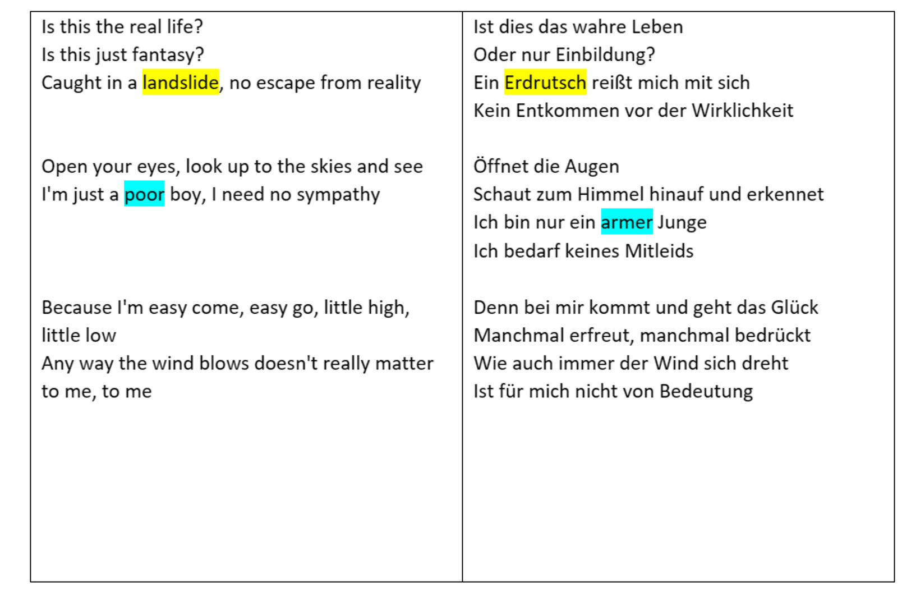
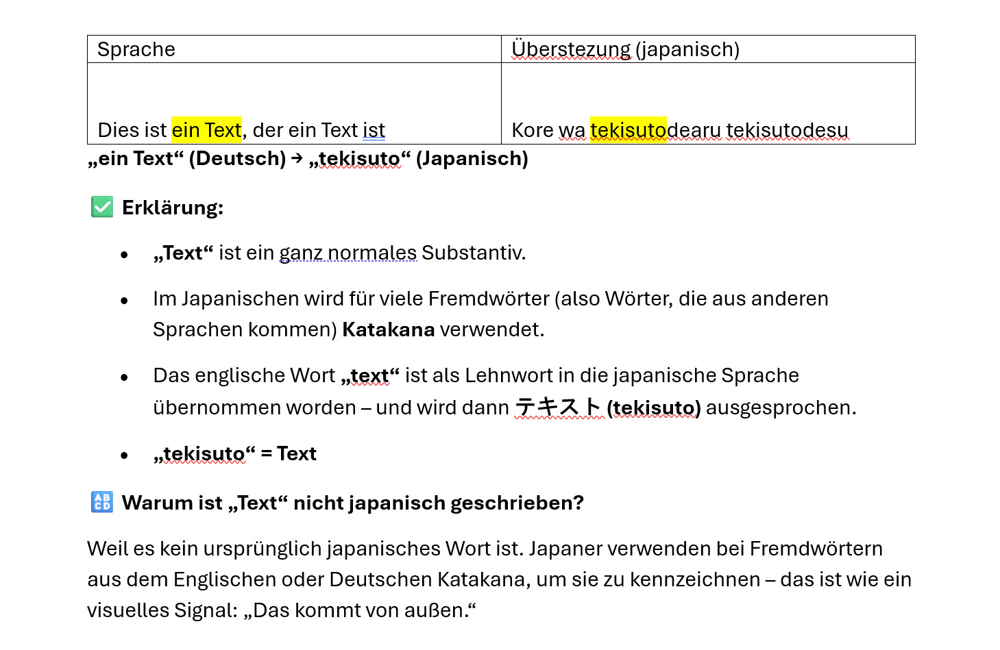

# NLP Project
# 📚 Vokabeltrainer mit Textmarkierung

## Beschreibung des Projektes


## 📝 Projektidee

Unsere Anwendung soll beim Vokabellernen unterstützen. Nutzer*innen können z. B. Songtexte oder andere Texte in ein Eingabefeld einfügen. Der Text wird auf Wunsch automatisch übersetzt.

Ein zentrales Feature ist die Möglichkeit, Wörter im Originaltext farblich zu markieren – diese Markierungen werden automatisch auch in der Übersetzung übernommen. Dadurch können gezielt neue Vokabeln im Kontext gelernt werden. Des weiteren soll bei den Markierungen Wörter erklärt werdne hinsichtlich der Herkunft, Bedeutung im Satz, Wortart und in einem anderen Kontext überführt werden als Beispiel. Dadurch soll dem Lernen ermöglicht werden effizient neue Wörter zu lernen und sie einprägsamer zu machen, da andere Kontextbeispiele für das Wort aufgezeigt werden.

<div style="display: flex; justify-content: center; gap: 20px;">
  
  
</div>

<p style="text-align: center;"><em>Abb.1: Beispielhafte Umsetzung unseres Vokabeltrainers.</em></p>


💡 Die Anwendung hat einen hohen Praxisbezug, erfordert allerdings einiges an Frontend-Arbeit.

---

## 👥 Gruppenmitglieder

- Maxi Zvada  
- Lukas Ihrig  
- Florian Wölfel  
- Noah Schlotz  
- Marius Essig

---

## Anforderungen an die Anwendung

### Benutzerfunktionen

- User kann sich einloggen und hat eine personalisierte Anwendung

### Übersetzungsfunktionen

- Text kann eingegeben werden und wird automatisch übersetzt

### Markierung von Wörtern

- Einzelne Wörter können markiert werden und werden dann farbig hinterlegt  
  _Hinweis_: Die Farbe soll unterschiedlich sein, wenn bereits ein Wort in einem Text markiert wurde – beim nächsten Wort soll eine andere Farbe verwendet werden.
- Das markierte Wort soll automatisch in allen Vorkommen des Textes markiert werden

### Übersetzungslogik

- Sollten mehrere Worte zu einer Übersetzung gehören, sollen diese alle gefunden werden und entsprechend markiert werden

### Zusatzfunktionen

- Mouseover über ein Wort soll es möglich machen, Definitionen oder Beispielsätze o.Ä. anzuzeigen

---

## 🚀 Installation & Setup

### 1. 📦 Voraussetzungen

- Python 3.10 oder höher
- [Node.js](https://nodejs.org/) (nur für Dev-Tools, optional)
- Paketmanager wie `pip`

### 2. 🔁 Repository klonen

```bash
git clone https://github.com/FloWoe/NLP_Project.git
cd dein-repo
```

### 3. Benötigte Libaires installieren:

```bash
pip install -r requirements.txt
python -m spacy download de_core_news_sm
python -m nltk.downloader punkt
```

### 4. 🎙️  Whisper vorbereiten (Speech-to-Text)

Whisper benötigt [ffmpeg](https://ffmpeg.org/), um Audio korrekt zu verarbeiten.

#### 🪟 Windows:

1. Lade die neueste ffmpeg-Version von der offiziellen Seite herunter:  
   👉 [https://www.gyan.dev/ffmpeg/builds/](https://www.gyan.dev/ffmpeg/builds/)

2. Entpacke den ZIP-Ordner z. B. nach:  
   `C:\ffmpeg`

3. Füge den Pfad zu `ffmpeg/bin` in deine **Systemumgebungsvariablen** hinzu:

   - Öffne die Windows-Suche und tippe: **"Umgebungsvariablen bearbeiten"**
   - Klicke bei **"Systemvariablen"** auf `Path` → `Bearbeiten`
   - Klicke auf `Neu` und füge hinzu:  
     `C:\ffmpeg\bin`

4. Starte das Terminal oder PowerShell neu und überprüfe, ob `ffmpeg` korrekt installiert ist:

   ```bash
   ffmpeg -version
   ```

### 5. API Key erstellen

ggf. muss auch neue KPI Keys für die Speech-to-Text, Text-to-Speech, Gemini und der Google Cloud Translation API neue API Keys erstellt werden.

### 6. Anwendung starten
```bash
python main.py
```
#### 🌐 Anwendung im Browser öffnen

Öffne deinen Browser und gehe zu:
[http://127.0.0.1:5000](http://127.0.0.1:5000)

---


