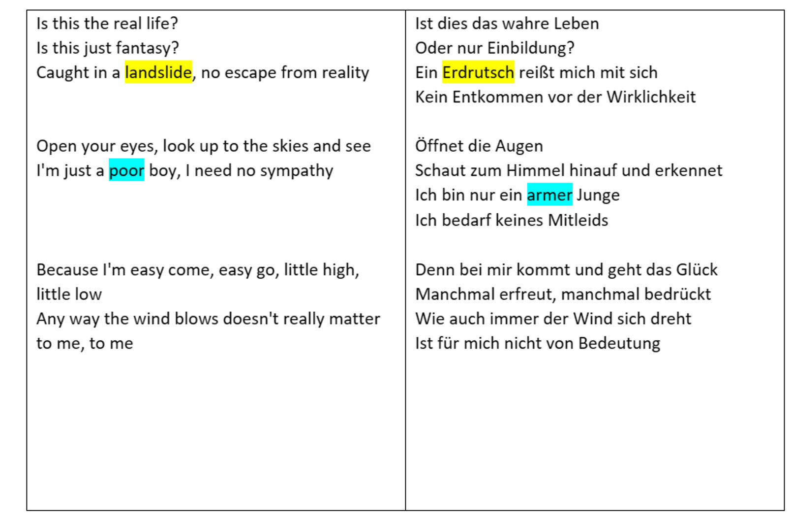
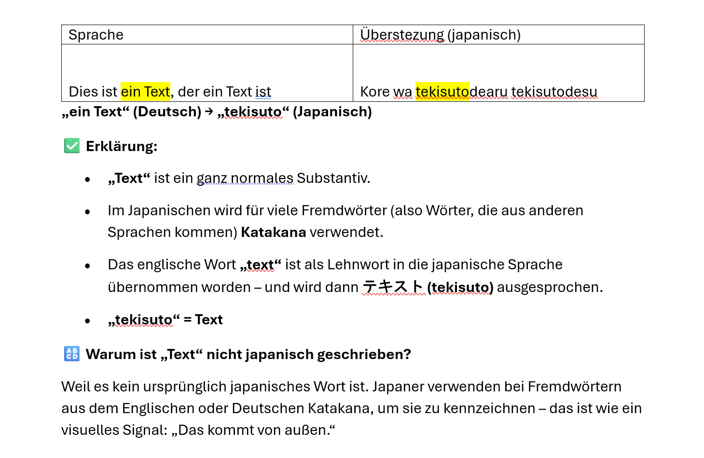

# NLP_Project

## Beschreibung des Projektes
# 📚 Vokabeltrainer mit Textmarkierung

## 📝 Projektidee

Unsere Anwendung soll beim Vokabellernen unterstützen. Nutzer*innen können z. B. Songtexte oder andere Texte in ein Eingabefeld einfügen. Der Text wird auf Wunsch automatisch übersetzt.

Ein zentrales Feature ist die Möglichkeit, Wörter im Originaltext farblich zu markieren – diese Markierungen werden automatisch auch in der Übersetzung übernommen. Dadurch können gezielt neue Vokabeln im Kontext gelernt werden. Des weiteren soll bei den Markierungen Wörter erklärt werdne hinsichtlich der Herkunft, Bedeutung im Satz, Wortart und in einem anderen Kontext überführt werden als Beispiel

  
  

💡 Die Anwendung hat einen hohen Praxisbezug, erfordert allerdings einiges an Frontend-Arbeit.

---

## 👥 Gruppenmitglieder

- Maxi Zvada  
- Lukas Ihrig  
- Florian Wölfel  
- Noah Schlotz  
- Marius Essig

